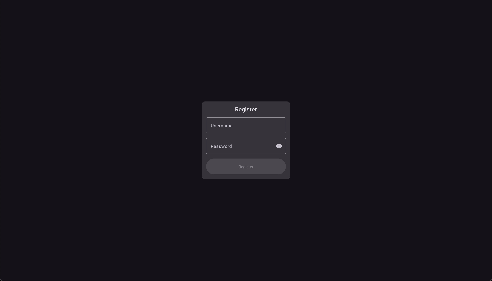
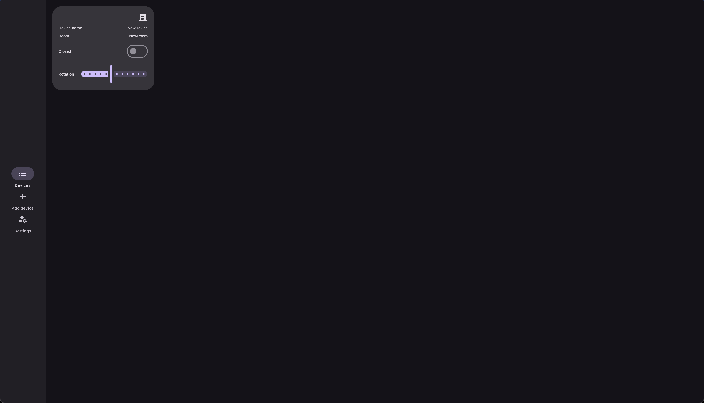

# TheOneClick

Home-automation sample project to explore:

- Fullstack Kotlin Multiplatform
- Scalability
- Security
- Minimal stack required
- Local development
- Unit and integration tests
- Shared code between client and server

## Server

- Ktor server
- QAAPI endpoints to set up the test data
- Auth flow with session-based auth for browsers and bearer tokens for mobile clients

## Client

- Compose multiplatform (browser-WASM and mobile-Android)
- Light and dark modes
- Responsive design mobile and desktop screen sizes
- Mock server for independent client development

## Custom Gradle plugins

- Minimize boilerplate code
- Reusability across multiple projects

## How to run?

1. Clone the repository
2. Open the project in IntelliJ IDEA
3. Use the provided run configurations to start the JVM server
4. Use the provided run configurations to start the WASM client
5. Sign in and begin using the application

## Screenshots

